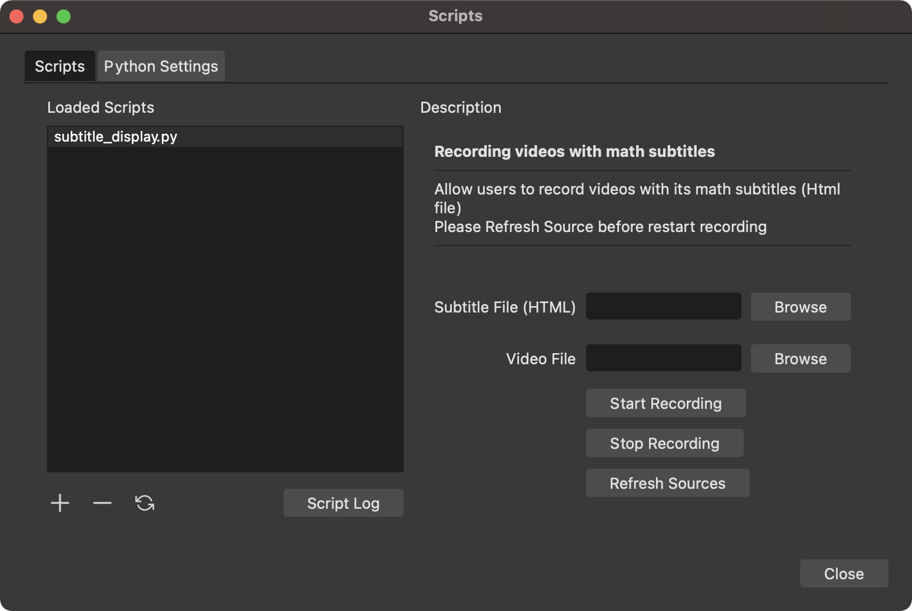
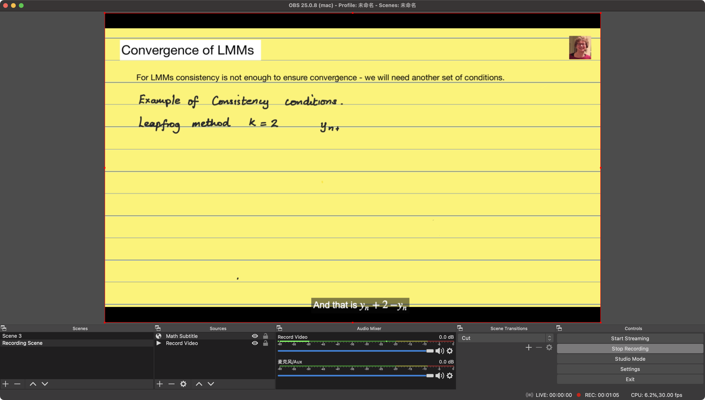
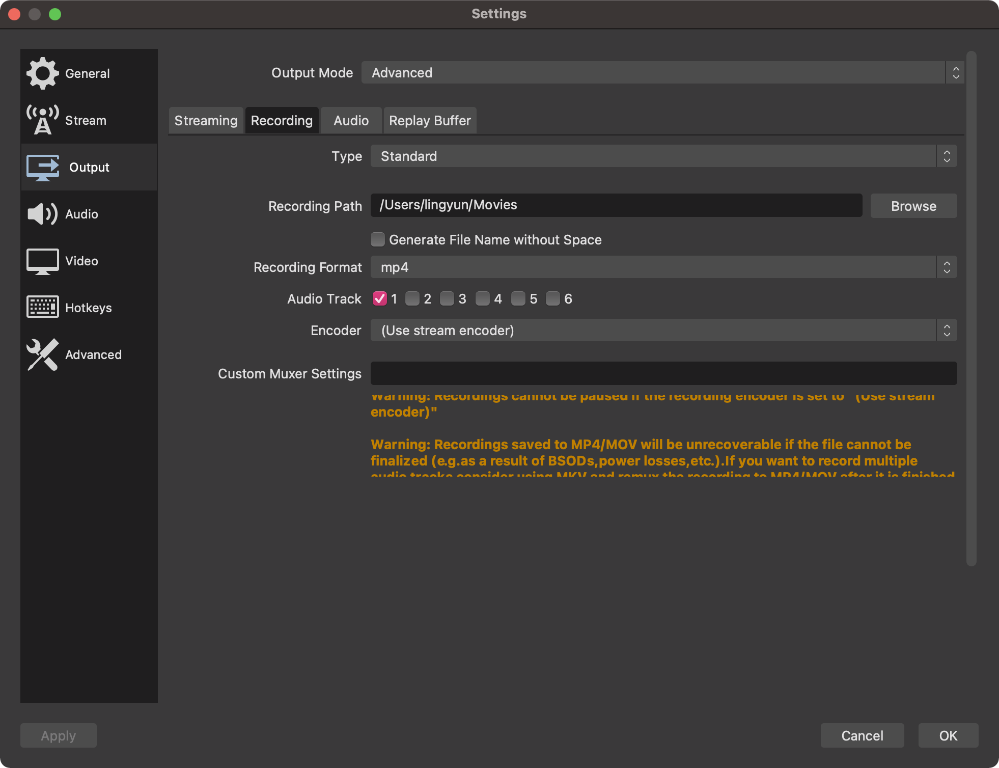

# OBS Video with Math Subtitle Recorder

  * Import a video and an html file which displays math equations by LaTeX.
  * The recording will stop automatically according to the length of the video.
  * User can manually stop the video or refresh the video and html sources.

## Use Case

The mathematics subtitling app (<https://github.com/Yukinooo7/Mathematics-subtitling-app>) allows users to generate Html files which can display math equations using LaTeX.

In order to display the math equations in the videos, users can use OBS studio to record open caption videos.

This script can help users to record the videos automatically so users do not need to know how to use OBS studio for recording and set the Sources manually.

## Example

- 

## OBS studio and Python Setup

- The recording path of recorded videos can be set in the Settings -> Output -> Recording -> Recording Path.
- The default recording format is `.mkv` which can also be changed in the previous position.
- 
- when developing and testing the script, I used OBS 25.0.8 and Python 3.7. OBS 26 and Python 3.6 may also run the script.
  - Some online tutorials said that OBS studio required Python <= 3.6 but Python 3.7 is fine for macOS (Some people said Windows still require Python <= 3.6).
  - OBS studio 25.0.8 download URL: https://github.com/obsproject/obs-studio/releases/tag/25.0.8
- In order to set Python path, go to Tools -> Scripts -> Python Settings

## Limitation

- This app can only display the HTML files generated by mathematics subtitling app. The position of subtitles may be inappropriate which will be fixed if I have time.
- I didn't find any API references from OBS documentation that can restart recording directly. If users want to restart recording, they can try `Refresh Sources -> Start Recording` or Click `Start Recording` twice.

## References

- obs_scene_importer (https://github.com/alexdean/obs_scene_importer.git) provides me with a way to resize the videos and browser to fit the OBS screen.